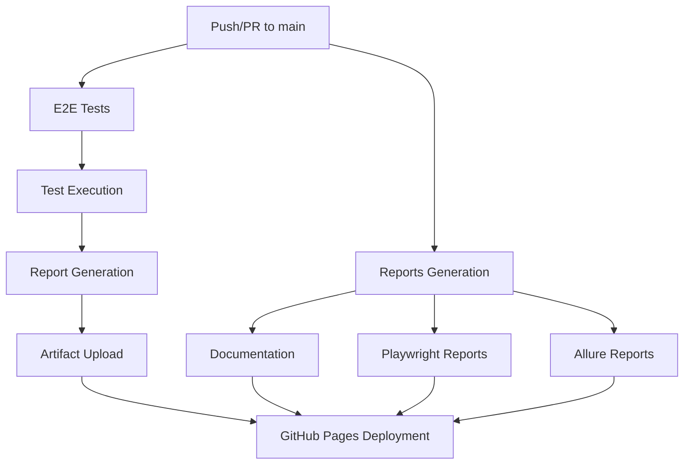
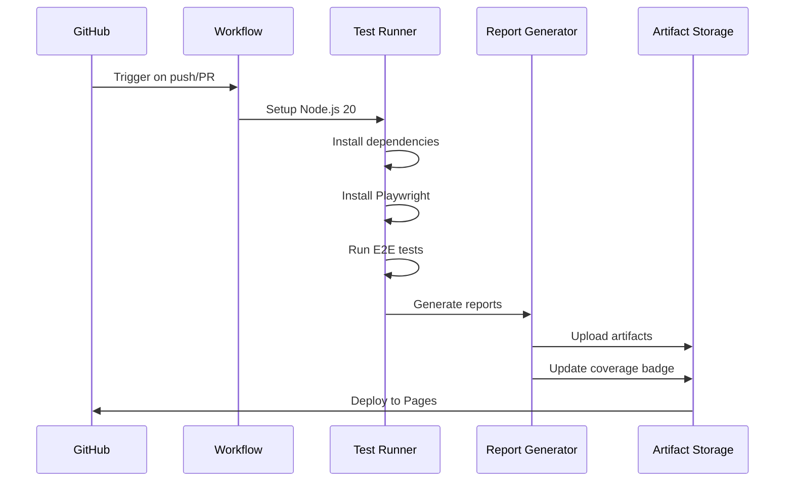
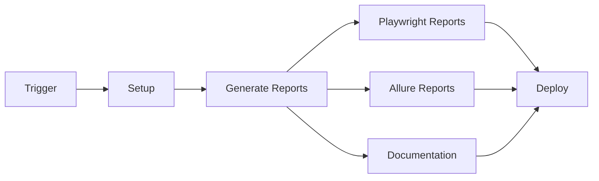
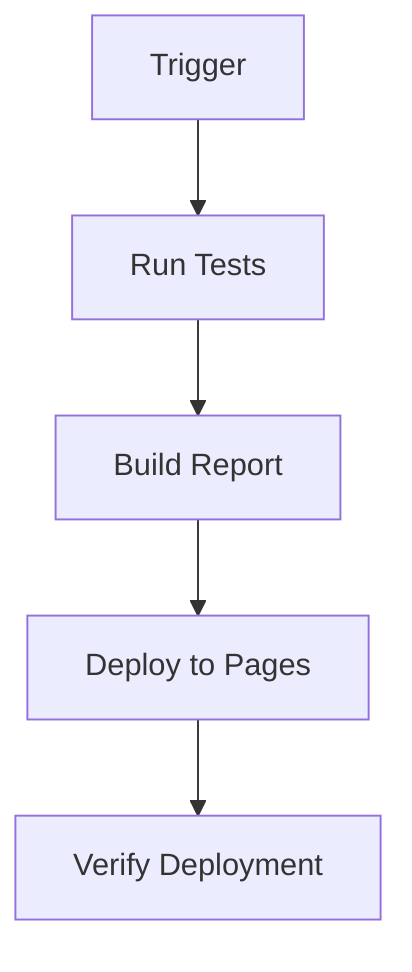
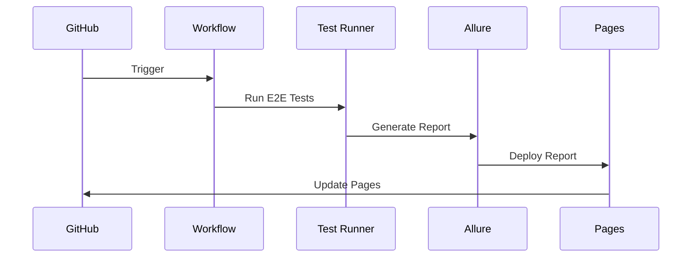
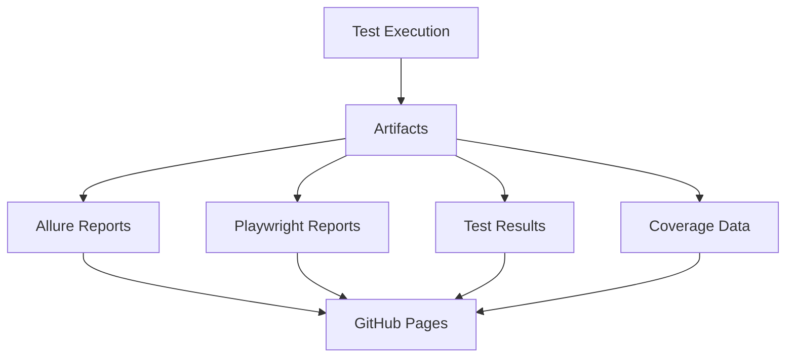
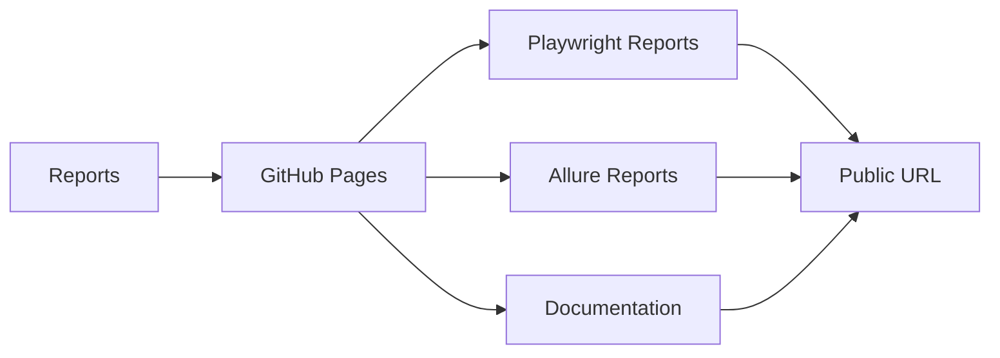

# CI/CD Workflows Documentation

This document provides an overview of the Continuous Integration and Continuous Deployment (CI/CD) workflows implemented in this project.

## Overview

The project implements a robust CI/CD pipeline using GitHub Actions, focusing on end-to-end testing, test reporting, and automated deployments. The workflows are designed to ensure code quality and provide comprehensive test coverage reporting.

## Pipeline Architecture

## Workflows

### 1. E2E Tests (`e2e-tests.yml`)

**Purpose**: Runs end-to-end tests and generates test reports.

**Triggers**:
- Push to main branch
- Pull requests to main branch

**Key Features**:
- Runs on Ubuntu latest
- Uses Node.js 20
- Installs Playwright browsers and dependencies
- Executes E2E tests
- Generates Allure and Playwright reports
- Uploads test artifacts
- Generates and updates test coverage badge
- Deploys reports to GitHub Pages

### 2. Reports Generation (`reports.yml`)

**Purpose**: Generates and deploys test reports to GitHub Pages.

**Triggers**:
- Push to main branch
- Manual trigger (workflow_dispatch)

**Key Features**:
- Generates multiple types of reports:
  - Playwright test reports
  - Allure reports
  - Documentation index page
- Deploys reports to different GitHub Pages directories:
  - Playwright reports: `/playwright`
  - Allure reports: `/allure`
  - Documentation: root directory

### 3. Playwright Report Deployment (`playwright-gh-pages.yml`)

**Purpose**: Specifically handles the deployment of Playwright test reports.

**Triggers**:
- Push to main branch

**Key Features**:
- Runs Playwright tests
- Builds Playwright report
- Deploys report to GitHub Pages

### 4. Allure Report Publishing (`allure-report.yml` and `allure-gh-pages.yml`)

**Purpose**: Handles the generation and deployment of Allure test reports.

**Triggers**:
- Push to main branch
- Manual trigger (workflow_dispatch)

**Key Features**:
- Runs E2E tests in CI mode
- Generates Allure reports
- Deploys reports to GitHub Pages

## Artifacts and Reports

The workflows generate and store several types of artifacts:

1. **Allure Reports**: Comprehensive test reports with detailed test execution information
2. **Playwright Reports**: Visual test execution reports
3. **Test Results**: Raw test execution data
4. **Test Coverage**: Code coverage metrics and badges

## GitHub Pages Deployment

All reports are automatically deployed to GitHub Pages:
- Playwright reports: `https://[username].github.io/[repo]/playwright`
- Allure reports: `https://[username].github.io/[repo]/allure`
- Documentation: `https://[username].github.io/[repo]`

## Best Practices

1. **Branch Protection**: Main branch should be protected to ensure all tests pass before merging
2. **Artifact Retention**: Configure appropriate retention periods for artifacts
3. **Environment Variables**: Use GitHub Secrets for sensitive information
4. **Cache Management**: Utilize npm caching for faster builds
5. **Concurrency Control**: Implement concurrency controls for deployments

## Maintenance

- Regularly update Node.js and action versions
- Monitor workflow execution times
- Review and optimize test execution
- Keep dependencies up to date
- Monitor GitHub Pages deployment status

## Troubleshooting

Common issues and solutions:
1. **Failed Tests**: Check test logs and reports for specific failures
2. **Deployment Issues**: Verify GitHub Pages settings and token permissions
3. **Build Failures**: Review dependency installation logs
4. **Report Generation**: Ensure proper configuration of Allure and Playwright

For more detailed information about specific workflows, refer to the individual workflow files in this directory.
