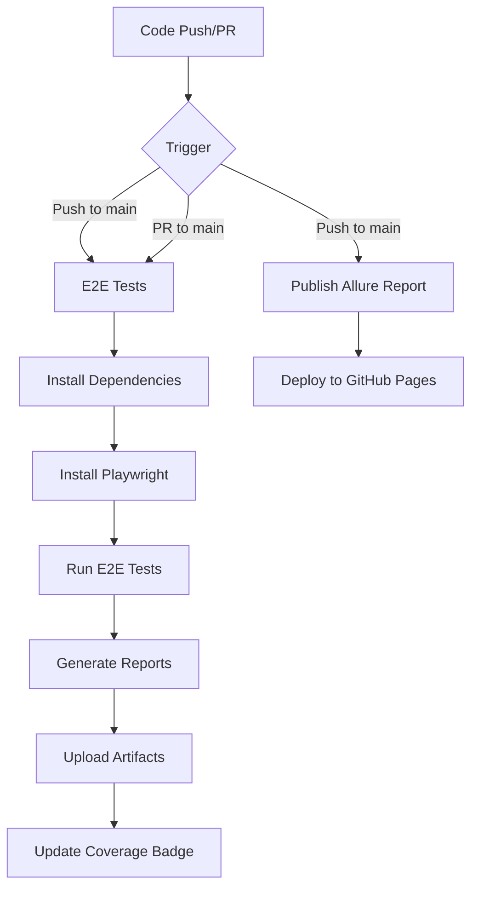
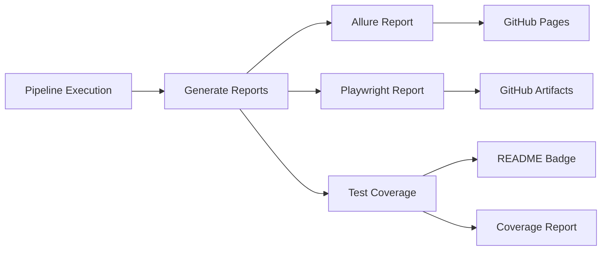
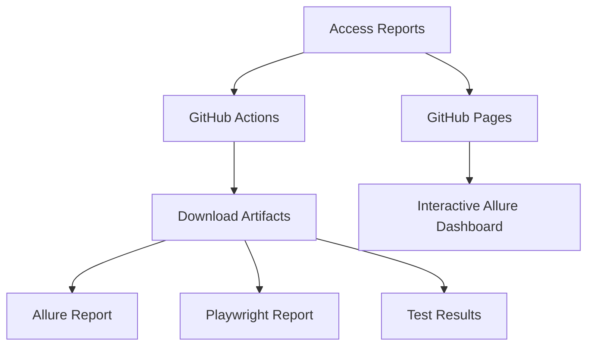

# CI/CD Pipeline Documentation

## Overview

This project implements a Continuous Integration and Continuous Deployment (CI/CD) pipeline using GitHub Actions. The pipeline ensures code quality through automated testing and provides detailed reports for monitoring and analysis.

## Pipeline Strategy

### Workflow Diagram

### Trigger Conditions
- The pipeline runs on:
  - Push to the `main` branch
  - Pull requests targeting the `main` branch

### Workflow Components

1. **E2E Tests Workflow** (`e2e-tests.yml`)
   - Runs on Ubuntu latest
   - Node.js version: 20
   - Key steps:
     - Install dependencies
     - Install Playwright browsers
     - Execute E2E tests
     - Generate and upload test reports
     - Update test coverage badge in README

2. **Allure Report Publishing** (`allure-gh-pages.yml`)
   - Publishes test reports to GitHub Pages
   - Triggered on pushes to main branch
   - Deploys Allure reports for easy access

## Quality Reports Access

### Report Access Flow

### Test Reports

1. **Allure Reports**
   - Access URL: `https://[your-organization].github.io/[repository-name]/`
   - Contains detailed test execution results
   - Includes test history, trends, and failure analysis
   - Updated automatically after each successful pipeline run

2. **Playwright Reports**
   - Available as pipeline artifacts
   - Access through GitHub Actions workflow runs
   - Contains detailed test execution logs and screenshots

3. **Test Coverage**
   - Coverage badge automatically updated in README.md
   - Detailed coverage reports available in pipeline artifacts

### Accessing Reports

1. **GitHub Actions Interface**
   - Navigate to the "Actions" tab in your repository
   - Select the workflow run you want to inspect
   - Under "Artifacts" section, download:
     - `allure-report`
     - `playwright-report`
     - `test-results`

2. **GitHub Pages**
   - Allure reports are automatically published to GitHub Pages
   - Access through the repository's GitHub Pages URL
   - Provides an interactive interface for test analysis

## Best Practices

1. **Before Creating a Pull Request**
   - Ensure all tests pass locally
   - Run `npm run test:e2e` to verify E2E tests
   - Check test coverage locally

2. **After Pipeline Execution**
   - Review Allure reports for test results
   - Check Playwright reports for any visual regressions
   - Monitor test coverage trends

3. **Troubleshooting**
   - If pipeline fails, check the specific job logs
   - Review test artifacts for detailed error information
   - Verify environment setup matches pipeline requirements

## Environment Requirements

- Node.js 20
- npm
- Playwright browsers
- GitHub Actions environment

## Maintenance

- Regularly update dependencies
- Monitor test execution times
- Review and update test coverage thresholds
- Keep documentation up to date with pipeline changes
