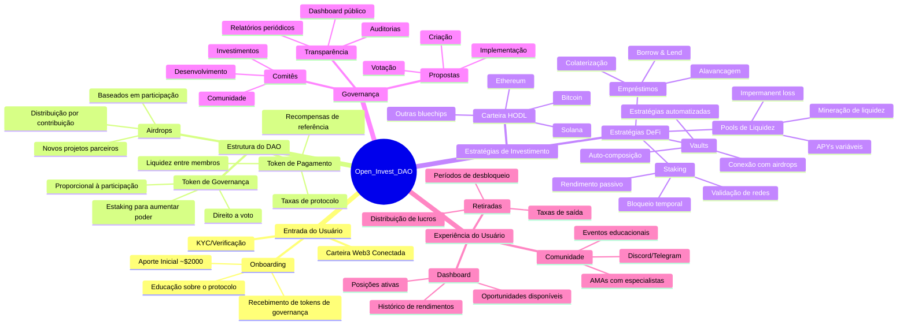

# Welcome to your Lovable project

## Project info

**URL**: https://lovable.dev/projects/d3795278-5d82-4dca-8eb4-794df4689bb7

## How can I edit this code?

There are several ways of editing your application.

**Use Lovable**

Simply visit the [Lovable Project](https://lovable.dev/projects/d3795278-5d82-4dca-8eb4-794df4689bb7) and start prompting.

Changes made via Lovable will be committed automatically to this repo.

**Use your preferred IDE**

If you want to work locally using your own IDE, you can clone this repo and push changes. Pushed changes will also be reflected in Lovable.

The only requirement is having Node.js & npm installed - [install with nvm](https://github.com/nvm-sh/nvm#installing-and-updating)

Follow these steps:

```sh
# Step 1: Clone the repository using the project's Git URL.
git clone <YOUR_GIT_URL>

# Step 2: Navigate to the project directory.
cd <YOUR_PROJECT_NAME>

# Step 3: Install the necessary dependencies.
npm i

# Step 4: Start the development server with auto-reloading and an instant preview.
npm run dev
```

**Edit a file directly in GitHub**

- Navigate to the desired file(s).
- Click the "Edit" button (pencil icon) at the top right of the file view.
- Make your changes and commit the changes.

**Use GitHub Codespaces**

- Navigate to the main page of your repository.
- Click on the "Code" button (green button) near the top right.
- Select the "Codespaces" tab.
- Click on "New codespace" to launch a new Codespace environment.
- Edit files directly within the Codespace and commit and push your changes once you're done.

## What technologies are used for this project?

This project is built with:

- Vite
- TypeScript
- React
- shadcn-ui
- Tailwind CSS

## How can I deploy this project?

Simply open [Lovable](https://lovable.dev/projects/d3795278-5d82-4dca-8eb4-794df4689bb7) and click on Share -> Publish.

## Can I connect a custom domain to my Lovable project?

Yes, you can!

To connect a domain, navigate to Project > Settings > Domains and click Connect Domain.

Read more here: [Setting up a custom domain](https://docs.lovable.dev/tips-tricks/custom-domain#step-by-step-guide)


# open_invest_dao

## Pod Cast

https://notebooklm.google.com/notebook/7083eb42-4db0-4117-8def-32d7424c396e/audio

> Mapa Mental do Protocolo Open_Invest_DAO

Antes de apresentar o mapa mental completo, este protocolo representa uma plataforma de investimento descentralizada onde os usuários podem participar coletivamente de investimentos em criptomoedas através de uma estrutura de DAO, recebendo tokens de governança, participando de decisões coletivas e sendo recompensados com airdrops baseados em sua participação.

## Mapa Mental em Mermaid



## Jornada do Usuário

### 1. Descoberta e Onboarding
O usuário conhece o Open_Invest_DAO através de comunidades cripto ou indicação. Após pesquisar sobre o projeto, participa do processo de onboarding que inclui:
- Verificação e conexão de carteira
- Aporte inicial (aproximadamente $2.000)
- Recebimento de tokens de governança
- Acesso a materiais educacionais sobre o funcionamento do DAO[2][7]

### 2. Participação no Ecossistema
Uma vez integrado, o usuário pode:
- Participar de votações sobre alocação de investimentos
- Propor novas estratégias de investimento
- Acompanhar o desempenho dos investimentos através do dashboard
- Interagir com outros membros da comunidade[4][18]

### 3. Benefícios e Recompensas
O protocolo oferece diversos benefícios aos participantes:
- Rendimentos proporcionais à participação nos investimentos
- Airdrops periódicos baseados em contribuição e participação
- Acesso a oportunidades exclusivas de yield farming
- Poder de decisão proporcional aos tokens de governança[3][9]

### 4. Estratégias de Investimento
O capital do DAO é distribuído em duas principais estratégias:
- Carteira HODL (longo prazo) com criptomoedas estabelecidas (Bitcoin, Ethereum, Solana)
- Estratégias DeFi que incluem:
  * Pools de liquidez com alto rendimento
  * Staking em diferentes protocolos
  * Vaults automatizados
  * Empréstimos colateralizados[8][11][12]

### 5. Governança e Transparência
Todo o processo decisório é transparente e colaborativo:
- Propostas são criadas, discutidas e votadas pela comunidade
- Relatórios periódicos mostram a performance dos investimentos
- Auditorias garantem a segurança dos fundos
- Dashboard público permite acompanhamento em tempo real[1][10]

## **Resumo Executivo**

O Open_Invest_DAO é um protocolo descentralizado de investimentos, construído com base em princípios de governança aberta, transparência e colaboração comunitária. Utilizando tecnologia blockchain e smart contracts, o protocolo permite que investidores de diferentes perfis se unam para propor, votar e executar investimentos coletivos em projetos inovadores, democratizando o acesso a oportunidades e reduzindo barreiras institucionais tradicionais[3].

---

## **Visão e Missão**

**Visão:**  
Ser a principal plataforma descentralizada de investimentos colaborativos, promovendo inclusão, transparência e eficiência no ecossistema financeiro digital.

**Missão:**  
Empoderar investidores por meio de governança participativa, compartilhamento seguro de informações e execução automática de decisões de investimento, alinhando interesses e otimizando resultados para todos os membros.

---

## **Fundamentos do Protocolo**

### **1. Estrutura DAO de Investimento**

- O Open_Invest_DAO opera como uma Organização Autônoma Descentralizada (DAO), onde todas as regras e operações são definidas e executadas por smart contracts, sem necessidade de intermediários[3].
- Os membros contribuem com fundos em criptomoedas e recebem tokens de governança, que representam sua participação e poder de voto nas decisões do DAO[3].

### **2. Propostas e Governança**

- Qualquer membro elegível pode submeter propostas de investimento, detalhando objetivo, valor solicitado, destinatário e prazo de votação.
- Propostas são submetidas a votação, com peso proporcional aos tokens de governança detidos por cada membro.
- Um mecanismo de snapshot garante que apenas detentores de tokens no momento da proposta possam votar, assegurando justiça e evitando manipulações[3].
- Propostas aprovadas por maioria e quórum mínimo são executadas automaticamente pelos smart contracts, transferindo fundos para o projeto escolhido[2][3].

### **3. Transparência e Auditoria**

- Todas as transações, votações e execuções de propostas são registradas on-chain, permitindo auditoria pública e reduzindo riscos de fraude ou má gestão[3].
- O protocolo adota padrões abertos de integração (APIs) para facilitar o compartilhamento seguro de dados de investimentos, alinhado às melhores práticas do Open Investment e Open Finance[1][5].

---

## **Funcionalidades Principais**

- **Gestão de Tesouraria Descentralizada:**  
  O tesouro do DAO é alimentado por contribuições dos membros e utilizado conforme decisões coletivas.

- **Tokens de Governança:**  
  Representam participação, poder de voto e, potencialmente, direitos econômicos em resultados de investimentos.

- **Processo de Propostas:**  
  Estrutura padronizada para submissão, discussão, votação e execução de investimentos.

- **APIs para Compartilhamento de Dados:**  
  Integração com sistemas financeiros e plataformas de Open Investment, permitindo visão global dos portfólios e personalização de ofertas[1][5].

---

## **Fluxo Operacional**

1. **Contribuição de Fundos:**  
   Membros depositam ativos digitais e recebem tokens de governança.

2. **Submissão de Propostas:**  
   Propostas de investimento são submetidas por membros elegíveis.

3. **Votação:**  
   Todos os detentores de tokens participam da votação, respeitando quórum e prazos definidos.

4. **Execução Automática:**  
   Propostas aprovadas são executadas por smart contracts, transferindo recursos conforme especificado.

5. **Auditoria e Transparência:**  
   Todas as etapas são públicas e auditáveis via blockchain.

---

## **Segurança e Compliance**

- Consentimento explícito dos usuários para compartilhamento de dados, conforme diretrizes do Open Finance[5].
- Smart contracts auditados e atualizados periodicamente para mitigar riscos de vulnerabilidades.
- Governança transparente, com mecanismos de defesa contra ataques de governança e spam de propostas[3].

---

## **Vantagens Competitivas**

- **Inclusão:**  
  Qualquer investidor pode participar, independentemente de localização ou porte.

- **Transparência:**  
  Todas as decisões e fluxos financeiros são públicos e imutáveis.

- **Eficiência:**  
  Execução automática reduz custos operacionais e elimina intermediários.

- **Personalização:**  
  Compartilhamento de dados permite ofertas e portfólios alinhados ao perfil de cada investidor[5].

---

## **Roadmap Inicial**

- Lançamento do smart contract principal e token de governança.
- Integração com APIs de Open Investment para compartilhamento de dados.
- Parcerias com projetos e plataformas para captação de propostas.
- Auditoria de segurança e programas de bug bounty.

---

## **Considerações Finais**

O Open_Invest_DAO representa uma evolução no modelo de investimentos, combinando o melhor dos mundos DeFi, Open Finance e governança comunitária. Ao alinhar incentivos, garantir transparência e facilitar o acesso a oportunidades, o protocolo visa redefinir o futuro dos investimentos colaborativos[3][5].

---

> "A grande oportunidade do Open Investment é poder oferecer uma assessoria cada vez mais qualificada, personalizada, a partir de uma visão global dos objetivos dos investidores e do seu apetite a risco, permitindo a construção de portfólios ainda mais aderentes às suas necessidades."[5]

---

**Este whitepaper é um documento vivo e será atualizado conforme o protocolo evolui e a comunidade contribui com melhorias.**

Citations:
[1] https://www.infomoney.com.br/guias/open-investment/
[2] https://github.com/inkdevhub/Investment-dao
[3] https://www.gate.io/learn/articles/a-complete-overview-of-investment-daos/8738
[4] https://www.bcb.gov.br/detalhenoticia/723/noticia
[5] https://investalk.bb.com.br/noticias/quero-aprender/conheca-o-open-investment-nova-fase-do-open-finance
[6] https://www.isa-opencampus.pt/introdu%C3%A7%C3%A3o-%C3%A0-metodologia-ruralinvest-da-fao
[7] https://en.wikipedia.org/wiki/The_DAO
[8] https://www.linkedin.com/posts/kuladao_dao-whitepaper-crypto-project-to-invest-activity-7098295474297716736-bRZ9
[9] https://economia.uol.com.br/mais/ultimas-noticias/2023/11/02/open-invest-vantagens-riscos.htm
[10] https://www.coinbase.com/es-la/learn/crypto-basics/what-are-investment-daos-and-why-are-they-important-for-investors
[11] https://inesc.org.br/wp-content/uploads/2023/05/fundo-amazonia-oriental_final.pdf
[12] https://github.com/lunardao/research/blob/master/investment_portal/README.md
[13] https://www.scribd.com/document/837926202/M3-DAO-Whitepaper
[14] https://exame.com/invest/minhas-financas/open-investment-o-que-e-e-quais-as-vantagens-para-investidores/
[15] https://www.gate.io/es/help/annlist/lastest/26919
[16] https://www.fao.org/brasil/programas-e-projetos/pt/
[17] https://www.vaneck.com/pt/en/daos/
[18] https://www.santander.com.br/blog/open-investment-para-empresa
[19] https://comunidade.nubank.com.br/t/open-investment-como-funciona-e-quais-s%C3%A3o-os-impactos/529663
[20] https://www.coinbase.com/es-la/price/dao-maker

Citations:
[1] https://www.chainalysis.com/blog/introduction-to-decentralized-autonomous-organizations-daos/
[2] https://gov.push.org/t/discussion-push-dao-onboarding-program/1676
[3] https://airdropalert.com/blogs/future-of-daos-and-airdrops/
[4] https://aminagroup.com/research/defi-investment-strategies-a-performance-review/
[5] https://mermaid.js.org/syntax/mindmap.html
[6] https://www.nngroup.com/articles/journey-mapping-101/
[7] https://daomasters.mirror.xyz/YNr-PuwUgp9LoK6xlrHhLlfKKo2GHzR8g00wBnfhQbc
[8] https://sdlccorp.com/post/defi-staking-platform-development-process/
[9] https://airdropalert.com/blogs/guide-to-airdrop-allocation-models/
[10] https://daogovernanceframework.com/wiki/DAO_Governance_Framework
[11] https://www.reddit.com/r/CryptoCurrency/comments/167yiti/liquidity_pools_and_impermanent_loss_for_dummies/
[12] https://osl.com/academy/article/what-is-liquidity-mining-how-to-profit-from-a-decentralized-ecosystem
[13] https://www.linkedin.com/pulse/customer-journey-mapping-cryptocurrency-navigating-digital-suvarna-zxspf
[14] https://mermaid.js.org/syntax/examples.html
[15] https://www.youtube.com/watch?v=bUbsxvsppGg
[16] https://legalnodes.com/article/dao-types
[17] https://docs.mermaidchart.com/blog/posts/from-chaos-to-clarity-exploring-mind-maps-with-mermaidjs
[18] https://crypto.com/en/university/what-is-a-dao-decentralised-autonomous-organisation
[19] https://newdevsguide.com/2023/04/14/mermaid-mind-maps/
[20] https://www.web3.university/article/the-pros-and-cons-of-building-a-dao
[21] https://wiki.fintechlab.unibocconi.eu/wiki/Voting_Mechanisms_in_DAO
[22] https://www.gemini.com/pt-BR/cryptopedia/dao-crypto-decentralized-governance-blockchain-governance
[23] https://creators.mirror.xyz/ggSQQlTSGqJ2_U7HVNjm4f3s98on5EfUyR9rW_z3fw0
[24] https://www.bitbond.com/resources/how-to-airdrop-tokens-the-comprehensive-guide/
[25] https://osl.com/academy/article/safeguarding-your-defi-journey
[26] https://limechain.tech/blog/dao-voting-mechanisms-explained-2022-guide
[27] https://firi.com/articles/what-is-a-dao-in-crypto
[28] https://daomasters.mirror.xyz/YNr-PuwUgp9LoK6xlrHhLlfKKo2GHzR8g00wBnfhQbc
[29] https://coinmarketcap.com/academy/article/skyren-dao-airdrop-guide-how-to-participate-and-claim-your-tokens
[30] https://exponential.fi/blog/the-defi-investing-journey-a-step-by-step-guide
[31] https://www.aragon.org/how-to/set-your-dao-governance
[32] https://www.linkedin.com/pulse/user-journey-buying-nft-tim-brady
[33] https://miro.com/templates/user-flow/
[34] https://docs.mermaidviewer.com/diagrams/mindmap.html
[35] https://mermaid.live
[36] https://www.figma.com/resource-library/user-journey-map/
[37] https://www.michalsons.com/blog/mapping-the-user-journey-legal-design/64563
[38] https://userpilot.com/blog/user-flow-examples/
[39] https://docs.mermaidchart.com/mermaid/mindmap/examples
[40] https://docs.mermaidchart.com/mermaid/mindmap/syntax
[41] https://miro.com/customer-journey-map/user-journey-map-examples/
[42] https://bitcoin.design/guide/designing-products/user-personas/
[43] https://www.lucidchart.com/blog/how-to-make-a-user-flow-diagram
[44] https://swimm.io/learn/mermaid-js/5-mermaid-js-examples-to-get-you-started
[45] https://www.reddit.com/r/CryptoCurrency/comments/167yiti/liquidity_pools_and_impermanent_loss_for_dummies/
[46] https://webisoft.com/articles/defi-staking/
[47] https://www.binance.com/en/square/post/9519226054386
[48] https://warwick.ac.uk/fac/soc/wbs/subjects/finance/gillmore/shardannualconference2023/12.00_-_tao_li_-_dao_governance_10.26.pdf
[49] https://hacken.io/discover/liquidity-pools/
[50] https://www.gov.br/ds/padroes/design/onboarding
[51] https://crypto.com/en/product-news/defi-staking
[52] https://www.investopedia.com/terms/a/airdrop-cryptocurrency.asp
[53] https://www.gemini.com/pt-BR/cryptopedia/decentralized-autonomous-organization-dao
[54] https://www.myetherwallet.com/blog/liquidity-in-crypto-how-to-use-liquidity-pools/
[55] https://hacken.io/discover/defi-staking/
[56] https://www.investopedia.com/decentralized-finance-defi-5113835
[57] https://designli.co/blog/user-flow-for-app-development-a-beginners-guide/
[58] https://empirica.io/blog/liquidity-mining/
[59] https://blog.defi.app/onboarding-the-next-100-million-users-into-defi-7a91204073c1
[60] https://www.youtube.com/watch?v=PBhvWc9LUeY
[61] https://www.kraken.com/learn/what-are-liquidity-provider-lp-tokens
[62] https://www.binance.com/en/square/post/21720719604905
[63] https://timesofindia.indiatimes.com/blogs/voices/the-rise-of-liquidity-pools-in-defi-understanding-how-they-work-and-their-significance-in-the-decentralized-landscape/
[64] https://www.nngroup.com/articles/user-journeys-vs-user-flows/
[65] https://osl.com/academy/article/what-are-liquidity-provider-lp-tokens
[66] https://osl.com/academy/article/what-is-defi-liquidity-mining-and-how-do-you-benefit-from-it
[67] https://cointelegraph.com/news/heres-how-one-company-is-solving-defis-issues-through-easy-onboarding-and-cross-chain-staking
[68] https://aigraphmaker.net/blog/create-mermaid-mindmap
[69] https://mermaid.js.org/syntax/flowchart.html
[70] https://www.linkedin.com/pulse/customer-journey-mapping-cryptocurrency-navigating-digital-suvarna-zxspf
[71] https://www.linkedin.com/advice/0/what-best-practices-onboarding-new-members-daos-skills-blockchain
[72] https://www.linkedin.com/advice/0/what-best-practices-creating-daos-onboarding-offboarding-458ee
[73] https://hhaxsupport.s3.amazonaws.com/SupportDocs/Enterprise/Process+Guides/Process+Guide+-+Digital+Applicant+Onboarding+(DAO).pdf
[74] https://www.youtube.com/watch?v=uKH1HVUuYYo
[75] https://de.fi
[76] https://www.hfsresearch.com/research/defy-defi-no-more/
[77] https://repositorio.utdt.edu/bitstreams/dc657a86-0beb-4251-aedd-555a2335edd4/download
[78] https://learn.microsoft.com/en-us/azure/active-directory-b2c/tutorial-create-user-flows
[79] https://flowinc.com/lp-onboarding.html

## Executando Testes End-to-End (E2E)

O projeto utiliza dois frameworks de teste E2E: Cypress e Playwright. Para facilitar a execução dos testes, foi criado um script shell (`run-e2e-tests.sh`) que oferece várias opções de execução.

### Pré-requisitos

Certifique-se de que todas as dependências do projeto estejam instaladas:

```bash
npm install
```

### Script de Execução

O script `run-e2e-tests.sh` oferece as seguintes opções:

```bash
# Mostrar ajuda
./run-e2e-tests.sh --help

# Executar todos os testes E2E (padrão)
./run-e2e-tests.sh

# Executar apenas testes Cypress
./run-e2e-tests.sh --cypress

# Executar apenas testes Playwright
./run-e2e-tests.sh --playwright

# Executar testes com interface gráfica (Cypress)
./run-e2e-tests.sh --cypress --ui

# Executar testes em modo debug
./run-e2e-tests.sh --debug

# Mostrar relatório de testes
./run-e2e-tests.sh --report
```

### Opções Disponíveis

- `-h, --help`: Mostra a mensagem de ajuda
- `-c, --cypress`: Executa apenas os testes Cypress
- `-p, --playwright`: Executa apenas os testes Playwright
- `-a, --all`: Executa todos os testes E2E (comportamento padrão)
- `-u, --ui`: Executa testes com interface gráfica (apenas Cypress)
- `-d, --debug`: Executa testes em modo debug
- `-r, --report`: Mostra o relatório de testes

### Executando Testes Específicos

#### Cypress

Para executar testes Cypress com interface gráfica:

```bash
npm run test:e2e:dev
```

Para executar testes Cypress em modo debug:

```bash
npm run test:e2e:debug
```

#### Playwright

Para executar testes Playwright com interface gráfica:

```bash
npm run test:e2e:ui
```

Para executar testes Playwright em modo debug:

```bash
npm run test:e2e:debug
```

### Visualizando Relatórios

Para visualizar o relatório de testes após a execução:

```bash
npm run test:e2e:report
```

### Observações Importantes

1. Certifique-se de que o servidor de desenvolvimento está rodando antes de executar os testes
2. Os testes podem ser executados em diferentes ambientes (desenvolvimento, produção, etc.)
3. Algumas opções são específicas para cada framework de teste
4. O modo debug é útil para identificar problemas específicos nos testes