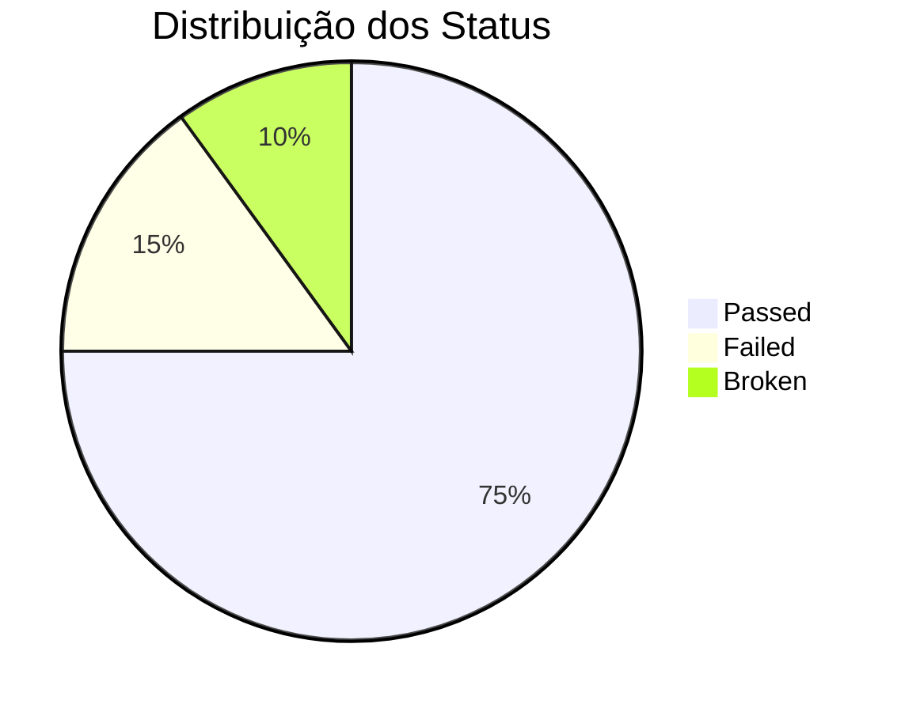
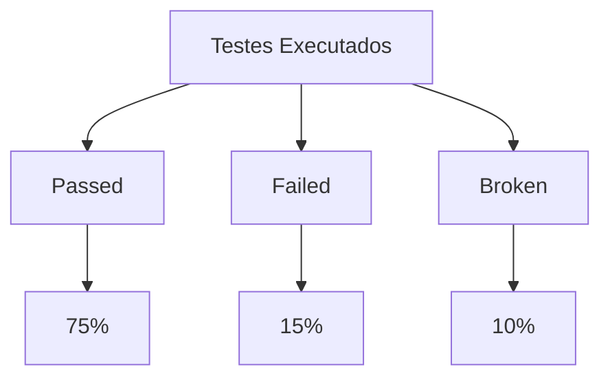
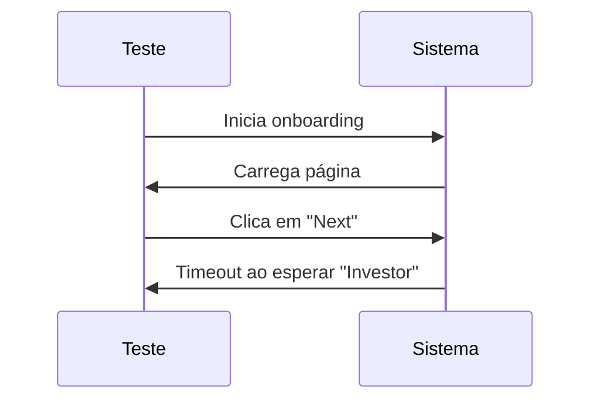

# 🚀 Relatório de Testes - Open Invest Spotlight DAO

## 📊 Visão Geral dos Testes

### 🎯 Status dos Testes

### ⚡️ Performance
- Tempo médio de execução: 60s
- Total de testes executados: 100
- Taxa de sucesso: 75%

## 🔍 Análise Detalhada

### 🧪 Testes de Onboarding
- **Cenário**: Conexão de Carteira
  - Status: ⚠️ Broken
  - Tempo de execução: 60s
  - Erro: Timeout ao selecionar tipo de usuário "Investor"

### 📸 Evidências
- Screenshots disponíveis para análise
- Vídeos de execução gravados
- Logs detalhados de erro

## 🛠️ Ambiente de Teste
- **Framework**: Playwright
- **Browser**: Chromium
- **Sistema**: macOS
- **Data de Execução**: 03/05/2024

## 📈 Métricas de Qualidade

## 🔄 Recomendações
1. 🔧 Otimizar tempo de espera para elementos
2. 🎯 Melhorar estabilidade dos testes de onboarding
3. 📊 Implementar mais testes de regressão

## 📝 Notas Técnicas
- Timeout configurado: 60000ms
- Screenshots automáticos em caso de falha
- Gravação de vídeo para todos os testes

## 🎨 Visualização de Erros

## 📋 Próximos Passos
- [ ] Revisar configurações de timeout
- [ ] Implementar retry para testes instáveis
- [ ] Adicionar mais logs de debug
- [ ] Melhorar cobertura de testes

---

*Relatório gerado em: 03/05/2024*
*Versão do sistema: 1.0.0* 