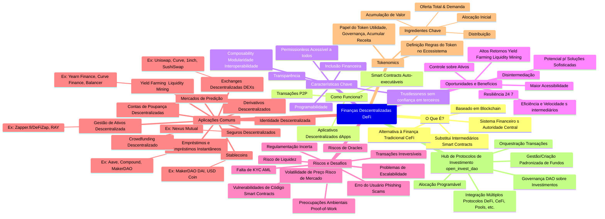

# Stake

Podcast: https://notebooklm.google.com/notebook/6c9f5d5f-2d31-48f6-b42a-bc7d312886de/audio

## # STACK.md - open_invest_dao

## Visão Geral

O **open_invest_dao** é um protocolo descentralizado para criação, administração e gestão de fundos de investimento, com foco em integração e orquestração de múltiplos protocolos de investimento. O objetivo é fornecer uma experiência padronizada, transparente e eficiente para gestores e participantes, utilizando um token único para pagamentos e governança, e um hub de integração para facilitar investimentos em diferentes protocolos Web3[4][5].

---

## Arquitetura da Stack

### **1. Token de Pagamento e Governança**

- **Padrão:** ERC20Votes (Ethereum) ou PSP22 (Polkadot/ink!)[2][5]
- **Funções:**
  - Representa participação no fundo e poder de voto.
  - Utilizado para pagamentos internos e distribuição de lucros.
  - Permite delegação de votos e governança on-chain.
- **Governança:** Todas as decisões (alocação, integração de protocolos, rebalanceamento) são tomadas via votação dos detentores do token[4][2].

---

### **2. Hub de Protocolos de Investimento**

- **Função:** Permitir ao fundo investir de forma unificada em múltiplos protocolos (DeFi, CeFi, pools, fundos tokenizados, staking, etc.).
- **Módulos Plugáveis:** Adaptadores para integração com protocolos como Uniswap, Aave, Compound, Yearn, entre outros.
- **Motor de Estratégias:** Permite definir, automatizar e rebalancear estratégias de alocação multi-protocolo.
- **Orquestração de Transações:** Execução eficiente de ordens em diferentes protocolos, agrupando transações e otimizando taxas.
- **Monitoramento:** Indexação e acompanhamento em tempo real dos investimentos, com geração de relatórios de performance e exposição[1][3].

---

### **3. Contratos Inteligentes**

- **Gestão do Fundo:** Controle descentralizado dos ativos via contratos inteligentes, com regras claras de alocação e resgate.
- **Propostas e Votação:** Sistema de propostas para novas integrações, alocações e rebalanceamentos, executadas automaticamente após aprovação[2][4][5].
- **Execução Automatizada:** Contratos executam ordens de investimento, distribuição de lucros e rebalanceamento conforme decisões da DAO.

---

### **4. Infraestrutura de Dados e Frontend**

- **Indexação:** Utilização de subgrafos (The Graph) para indexar eventos e facilitar consultas.
- **Frontend:** Interface web descentralizada para criação, gestão e acompanhamento dos fundos.
- **APIs:** Serviços para integração de dados de performance, histórico de votação e relatórios padronizados (Open Protocol)[1].

---

### **5. Segurança e Auditoria**

- **Carteira Multisig:** Para movimentação de grandes valores e execuções sensíveis.
- **Auditorias Externas:** Revisão periódica dos contratos inteligentes.
- **Permissões Granulares:** Controle rigoroso de acesso e execução de funções críticas.

---

## Fluxo de Funcionamento

1. **Criação do Fundo:** Gestores utilizam a interface para criar um novo fundo, definindo regras e parâmetros.
2. **Definição de Estratégia:** Propostas de alocação são submetidas e votadas pela comunidade.
3. **Investimento Multi-Protocolo:** O hub executa as ordens aprovadas, alocando recursos em diferentes protocolos integrados.
4. **Gestão e Rebalanceamento:** Estruturas automatizadas e decisões coletivas garantem eficiência e transparência.
5. **Relatórios e Transparência:** Toda movimentação é registrada, auditável e acessível aos participantes.

---

## Tecnologias Utilizadas

| Camada                | Tecnologia/Ferramenta        |
|-----------------------|-----------------------------|
| Blockchain            | Ethereum (Solidity), Polkadot (ink!) |
| Token                 | ERC20Votes, PSP22           |
| Governança            | OpenZeppelin Governor, DAOstack, Custom DAO contracts |
| Integração Protocolos | Adaptadores customizados     |
| Indexação             | The Graph                   |
| Frontend              | React, ethers.js, Polkadot.js |
| Segurança             | Gnosis Safe, Auditorias externas |
| Relatórios            | Open Protocol, APIs customizadas |

---

## Diferenciais do open_invest_dao

- **Hub de Integração:** Permite ao fundo investir de forma padronizada e transparente em múltiplos protocolos, facilitando diversificação e gestão ativa.
- **Governança Descentralizada:** Todas as decisões estratégicas são tomadas coletivamente, sem intermediários.
- **Padronização e Transparência:** Relatórios e operações seguem padrões reconhecidos (como Open Protocol), facilitando auditoria e integração com outros sistemas[1].
- **Automação:** Execução automatizada de estratégias e rebalanceamento, reduzindo riscos operacionais e humanos.

---

## Inspirações e Referências

- [Open Protocol (SBAI)](https://www.sbai.org/toolbox-resources/open-protocol.html): Padrão para coleta e reporte de dados de risco e exposição[1].
- [DAOstack](https://github.com/daostack/DAOstack-Hackers-Kit): Framework para construção de DAOs modulares[5].
- [Investment DAOs Overview](https://www.gate.io/learn/articles/a-complete-overview-of-investment-daos/8738): Conceitos de DAOs de investimento e governança descentralizada[4].
- [LunarDAO](https://github.com/lunardao/research/blob/master/investment_portal/README.md): Exemplo de DAO com tese de investimento e portal de oportunidades[3].

---

**Este documento serve como referência para desenvolvedores, gestores e participantes do open_invest_dao, detalhando a stack técnica e os diferenciais do protocolo.**

Citations:
[1] https://www.sbai.org/toolbox-resources/open-protocol.html
[2] https://github.com/inkdevhub/Investment-dao
[3] https://github.com/lunardao/research/blob/master/investment_portal/README.md
[4] https://www.gate.io/learn/articles/a-complete-overview-of-investment-daos/8738
[5] https://github.com/daostack/DAOstack-Hackers-Kit/blob/master/README.md
[6] https://www.stackingdao.com/post/stacking-dao-roadmap
[7] https://cryptonews.com/exclusives/investment-daos/
[8] https://github.com/daostack/DAOstack-Hackers-Kit
[9] https://defillama.com/governance/stake-dao
[10] https://www.youtube.com/watch?v=Z9uWtQSoFJU
[11] https://www.youtube.com/watch?v=U3md3d647zA
[12] https://www.gate.io/state_compliance_tips
[13] https://www.gemini.com/cryptopedia/nft-dao-investment-fund-introduction-to-daos
[14] https://www.diadata.org/bitcoin-ecosystem-map/stackingdao/
[15] https://coinrivet.com/visionsdao-exits-stealth-mode-and-presents-a-modular-stack-for-gamefi-that-enables-sustainable-economies/
[16] https://www.binance.com/en/square/post/964625
[17] https://blockworks.co/news/the-investors-guide-to-daos
[18] https://www.iisd.org/itn/2023/07/01/the-protocol-on-investment-to-the-agreement-establishing-the-african-continental-free-trade-area-whats-in-it-and-whats-next-for-the-continent/
[19] https://edit.wti.org
[20] https://openimis.atlassian.net/wiki/spaces/OP/pages/606208025/Target+Technology+Stack
