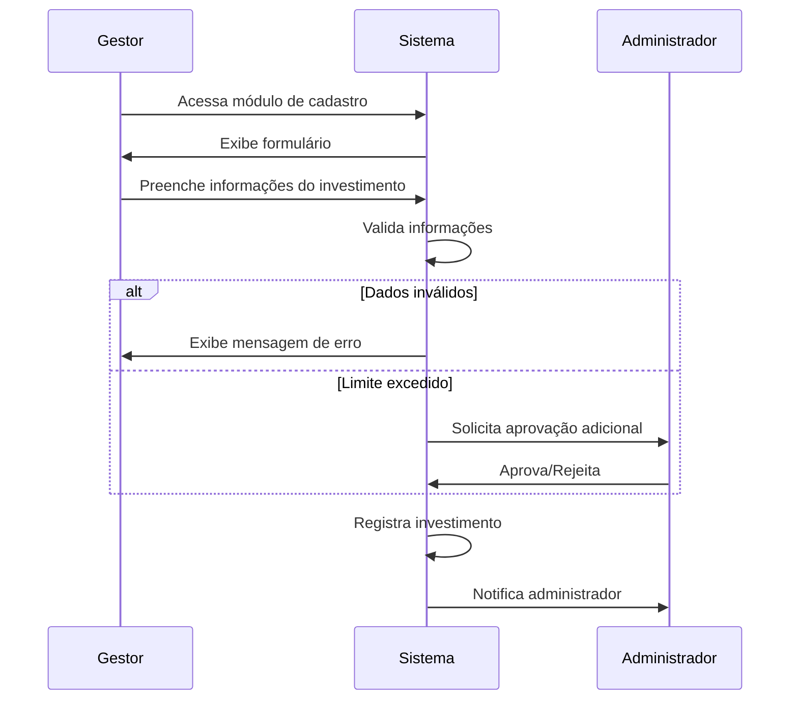
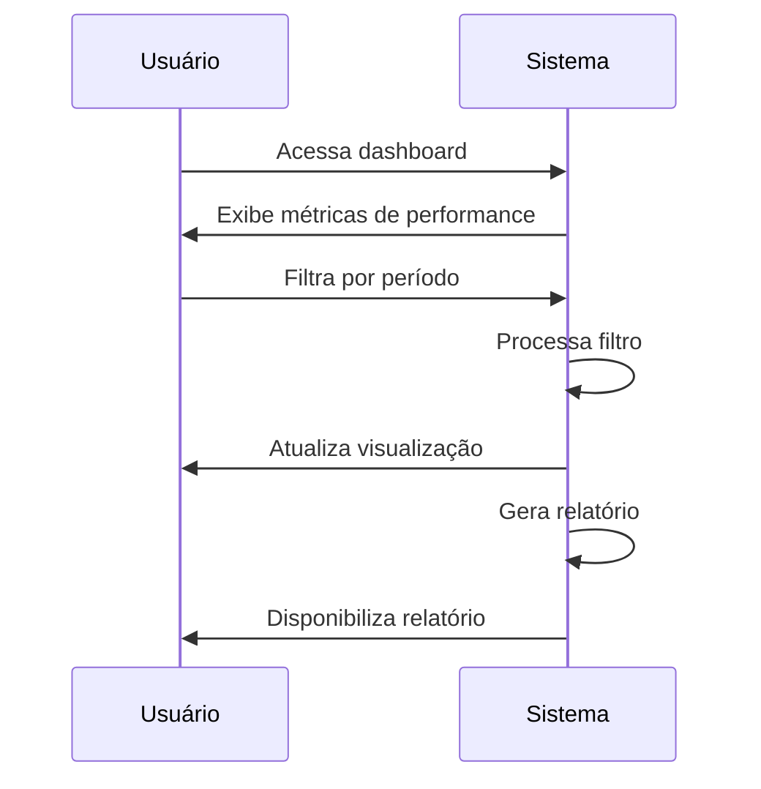
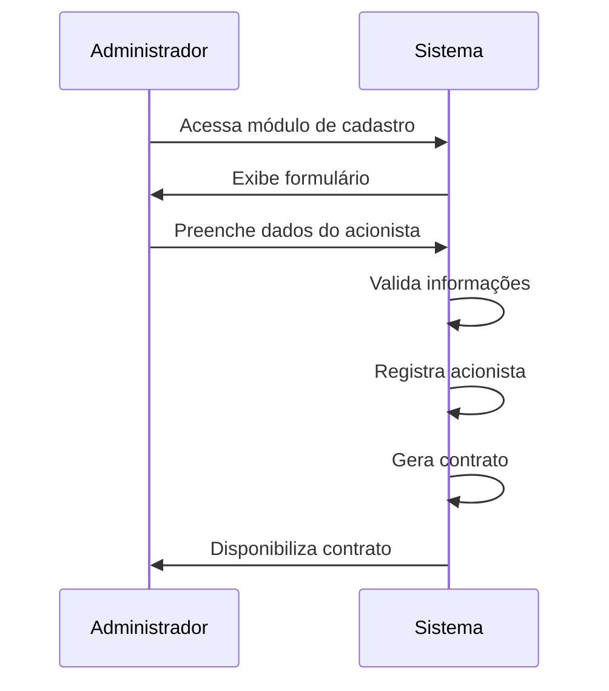
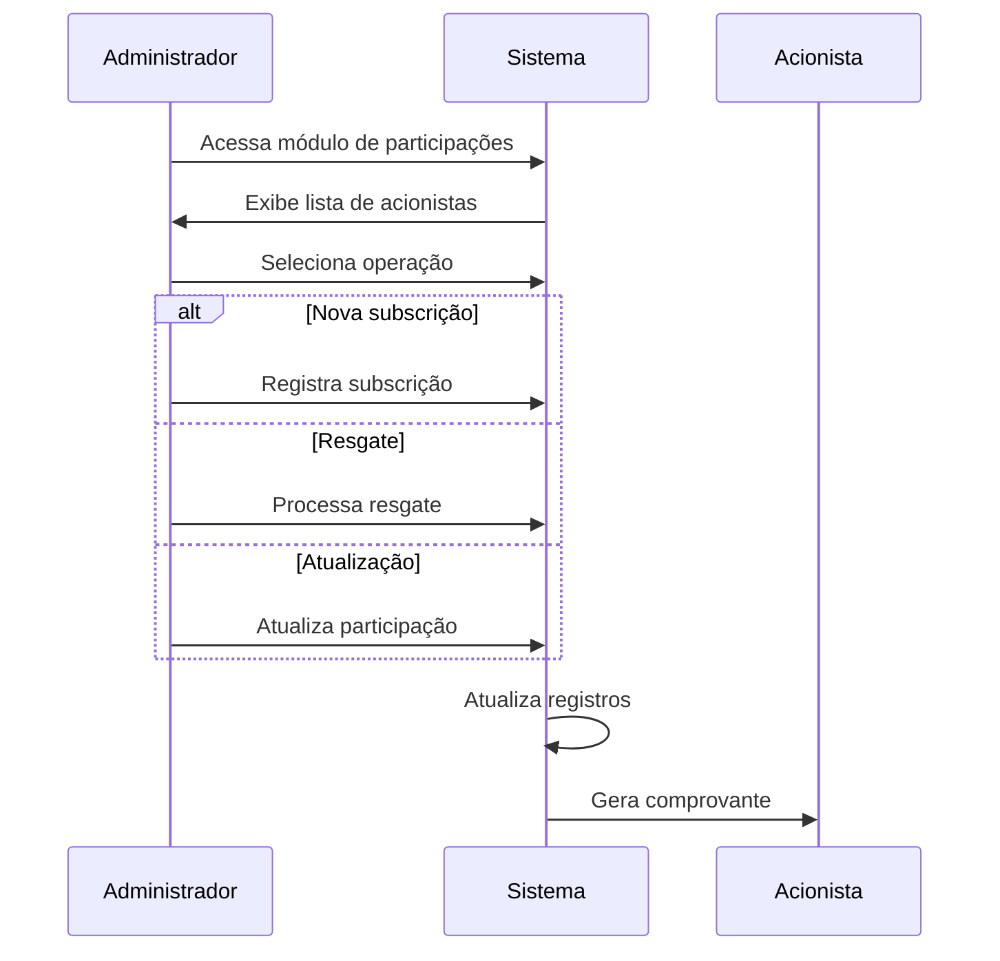
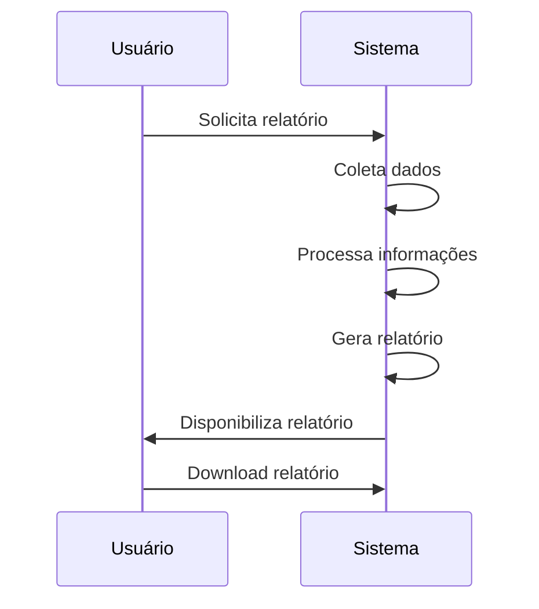
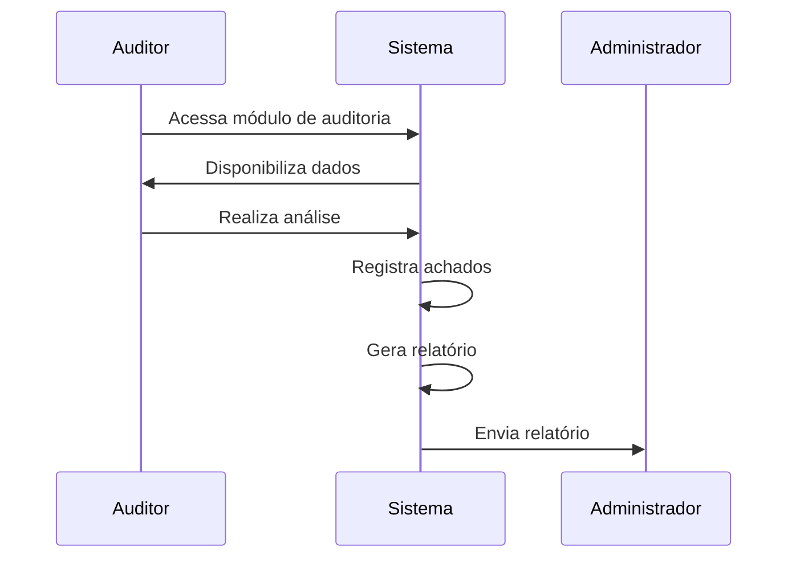
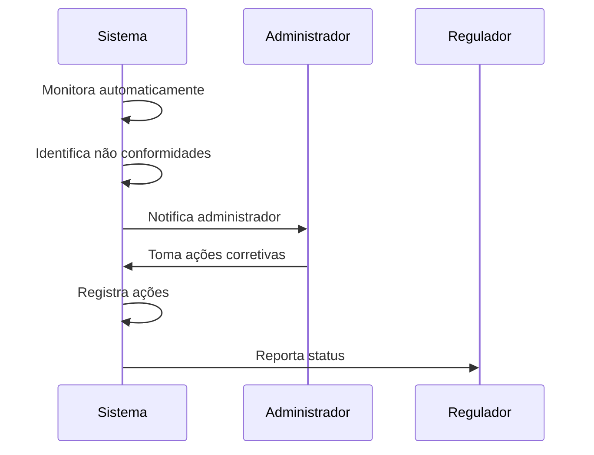
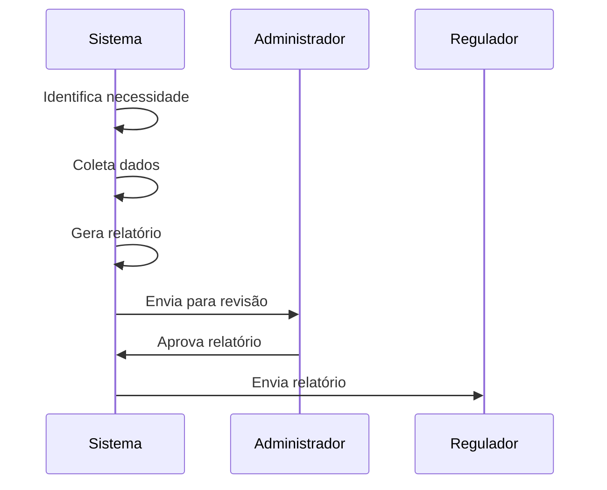
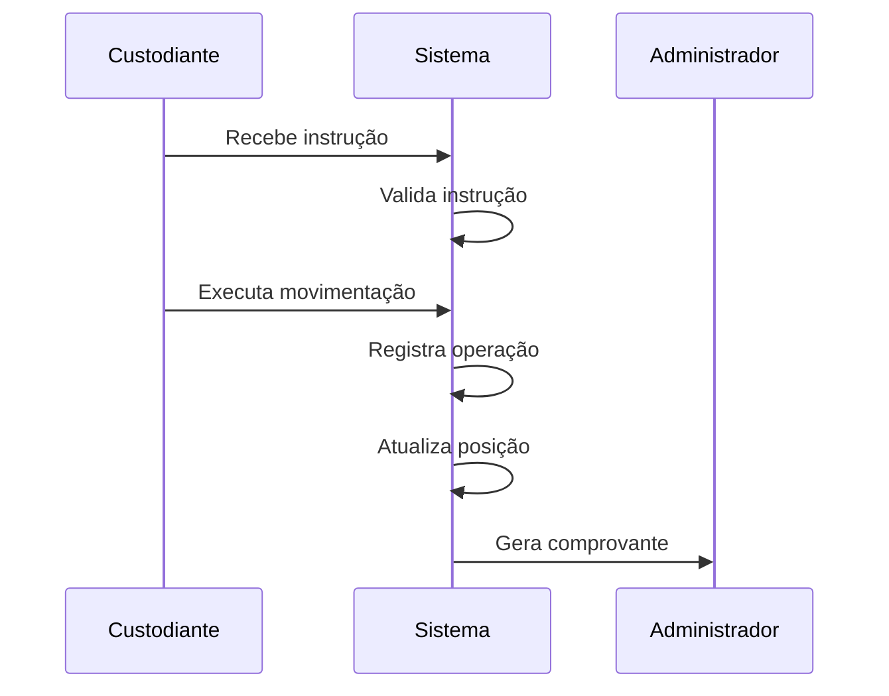
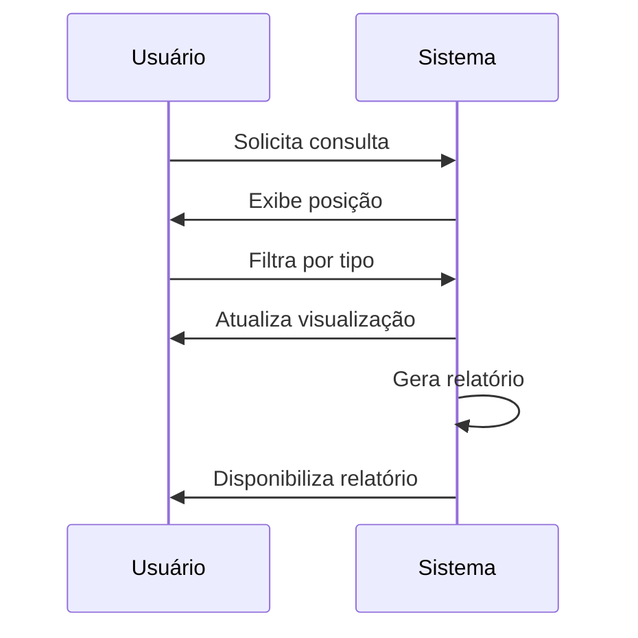

# Casos de Uso do Sistema

## 1. Gestão de Investimentos

### UC1.1 - Cadastrar Novo Investimento
**Atores Principais**: Gestor de Investimentos, Administrador do Fundo
**Pré-condições**: 
- Gestor autenticado no sistema
- Análise de investimento concluída

**Fluxo Principal**:
1. Gestor acessa o módulo de cadastro de investimentos
2. Sistema exibe formulário de cadastro
3. Gestor preenche informações do investimento:
   - Tipo de ativo
   - Valor do investimento
   - Prazo
   - Risco
   - Retorno esperado
4. Sistema valida informações
5. Sistema registra investimento
6. Sistema notifica administrador do fundo

**Fluxos Alternativos**:
- 4a. Dados inválidos: Sistema exibe mensagem de erro
- 5a. Limite de investimento excedido: Sistema solicita aprovação adicional

### UC1.2 - Monitorar Performance de Investimentos
**Atores Principais**: Gestor de Investimentos, Acionista
**Pré-condições**: 
- Investimentos cadastrados no sistema

**Fluxo Principal**:
1. Usuário acessa dashboard de performance
2. Sistema exibe métricas de performance:
   - Retorno sobre investimento
   - Comparativo com benchmark
   - Risco do portfólio
3. Usuário pode filtrar por período
4. Sistema gera relatório de performance

## 2. Gestão de Acionistas

### UC2.1 - Cadastrar Novo Acionista
**Atores Principais**: Administrador do Fundo
**Pré-condições**: 
- Administrador autenticado no sistema

**Fluxo Principal**:
1. Administrador acessa módulo de cadastro de acionistas
2. Sistema exibe formulário de cadastro
3. Administrador preenche dados do acionista:
   - Dados pessoais/empresariais
   - Documentação necessária
   - Perfil de investidor
4. Sistema valida informações
5. Sistema registra acionista
6. Sistema gera contrato de adesão

### UC2.2 - Gerenciar Participação Acionária
**Atores Principais**: Administrador do Fundo, Acionista
**Pré-condições**: 
- Acionista cadastrado no sistema

**Fluxo Principal**:
1. Administrador acessa módulo de participações
2. Sistema exibe lista de acionistas e suas participações
3. Administrador pode:
   - Registrar novas subscrições
   - Processar resgates
   - Atualizar percentual de participação
4. Sistema atualiza registros
5. Sistema gera comprovante da operação

## 3. Relatórios e Auditoria

### UC3.1 - Gerar Relatório de Performance
**Atores Principais**: Administrador do Fundo, Auditor
**Pré-condições**: 
- Dados de performance disponíveis

**Fluxo Principal**:
1. Usuário solicita geração de relatório
2. Sistema coleta dados necessários
3. Sistema processa informações
4. Sistema gera relatório com:
   - Performance do fundo
   - Composição do portfólio
   - Comparativos de mercado
5. Sistema disponibiliza relatório para download

### UC3.2 - Realizar Auditoria
**Atores Principais**: Auditor, Administrador do Fundo
**Pré-condições**: 
- Auditor autenticado no sistema
- Período de auditoria definido

**Fluxo Principal**:
1. Auditor acessa módulo de auditoria
2. Sistema disponibiliza dados para análise:
   - Transações financeiras
   - Documentação de investimentos
   - Registros de acionistas
3. Auditor realiza análise
4. Sistema registra achados da auditoria
5. Sistema gera relatório de auditoria

## 4. Conformidade Regulatória

### UC4.1 - Monitorar Conformidade
**Atores Principais**: Administrador do Fundo, Regulador
**Pré-condições**: 
- Sistema configurado com regras regulatórias

**Fluxo Principal**:
1. Sistema monitora automaticamente:
   - Limites de investimento
   - Composição do portfólio
   - Documentação necessária
2. Sistema identifica não conformidades
3. Sistema notifica administrador
4. Administrador toma ações corretivas
5. Sistema registra ações tomadas

### UC4.2 - Submeter Relatórios Regulatórios
**Atores Principais**: Administrador do Fundo, Regulador
**Pré-condições**: 
- Dados necessários disponíveis no sistema

**Fluxo Principal**:
1. Sistema identifica necessidade de envio de relatório
2. Sistema coleta dados necessários
3. Sistema gera relatório no formato regulatório
4. Administrador revisa e aprova relatório
5. Sistema envia relatório para regulador

## 5. Custódia de Ativos

### UC5.1 - Registrar Movimentação de Ativos
**Atores Principais**: Custodiante, Administrador do Fundo
**Pré-condições**: 
- Operação autorizada
- Documentação necessária disponível

**Fluxo Principal**:
1. Custodiante recebe instrução de movimentação
2. Sistema valida instrução
3. Custodiante executa movimentação
4. Sistema registra operação
5. Sistema atualiza posição dos ativos
6. Sistema gera comprovante da operação

### UC5.2 - Consultar Posição de Ativos
**Atores Principais**: Custodiante, Administrador do Fundo
**Pré-condições**: 
- Ativos registrados no sistema

**Fluxo Principal**:
1. Usuário solicita consulta de posição
2. Sistema exibe:
   - Lista de ativos
   - Quantidades
   - Valores
   - Localização
3. Usuário pode filtrar por tipo de ativo
4. Sistema gera relatório de posição
