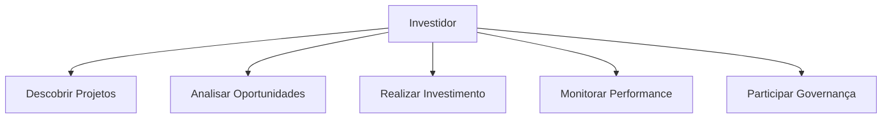
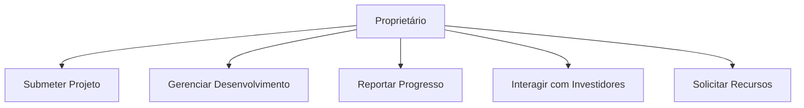
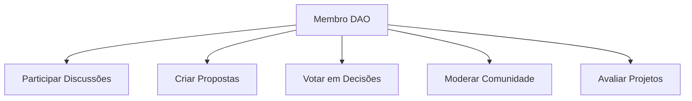
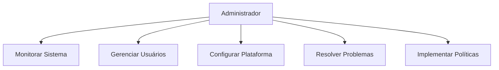
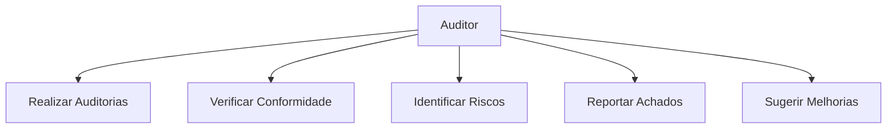
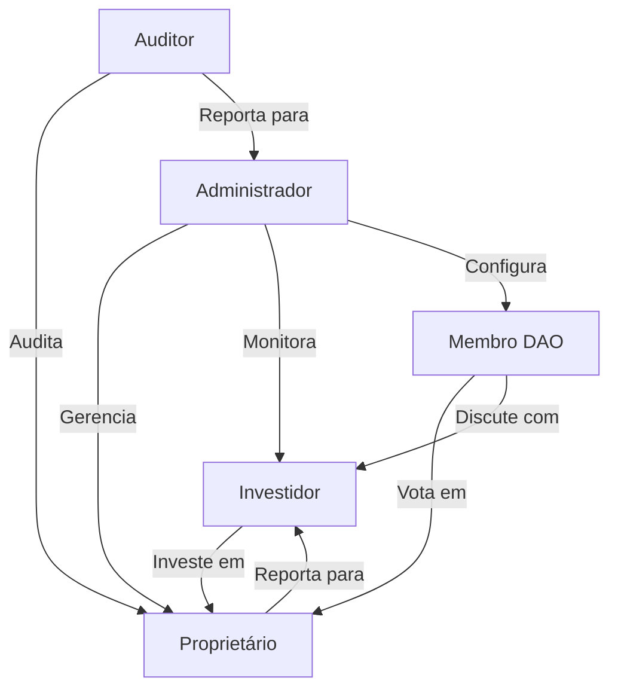

# Atores do Sistema

## Visão Geral

Este documento detalha os diferentes tipos de atores que interagem com o Open Invest Spotlight DAO, suas responsabilidades, permissões e fluxos de interação.

## 1. Investidor

### Perfil
- **Descrição**: Indivíduo ou instituição que investe em projetos através da plataforma
- **Objetivo**: Buscar retorno financeiro e participar da governança dos projetos
- **Nível de Experiência**: Variado (iniciante a avançado)

### Responsabilidades
1. **Gestão de Investimentos**
   - Analisar projetos disponíveis
   - Realizar investimentos
   - Monitorar performance
   - Gerenciar portfólio

2. **Participação**
   - Votar em propostas
   - Participar de discussões
   - Avaliar projetos
   - Sugerir melhorias

### Permissões
- Acesso ao dashboard de investimentos
- Visualização de projetos
- Participação em votações
- Acesso a relatórios de performance
- Comunicação com proprietários

### Fluxos Principais

## 2. Proprietário de Projeto

### Perfil
- **Descrição**: Criador e gestor de projetos na plataforma
- **Objetivo**: Obter financiamento e desenvolver projetos
- **Nível de Experiência**: Técnico/Especialista

### Responsabilidades
1. **Gestão de Projeto**
   - Submeter projetos
   - Atualizar progresso
   - Gerenciar equipe
   - Reportar resultados

2. **Comunicação**
   - Interagir com investidores
   - Responder dúvidas
   - Apresentar atualizações
   - Solicitar recursos

### Permissões
- Acesso ao painel de gestão
- Edição de informações do projeto
- Geração de relatórios
- Comunicação com investidores
- Gestão de equipe

### Fluxos Principais

## 3. Membro DAO

### Perfil
- **Descrição**: Participante ativo da governança da plataforma
- **Objetivo**: Influenciar direção e decisões
- **Nível de Experiência**: Conhecimento em governança

### Responsabilidades
1. **Governança**
   - Propor mudanças
   - Votar em propostas
   - Participar de discussões
   - Avaliar projetos

2. **Comunidade**
   - Moderar discussões
   - Auxiliar novos membros
   - Promover engajamento
   - Reportar problemas

### Permissões
- Acesso ao fórum de governança
- Criação de propostas
- Participação em votações
- Moderação de discussões
- Acesso a relatórios

### Fluxos Principais

## 4. Administrador

### Perfil
- **Descrição**: Gestor da plataforma
- **Objetivo**: Manter operação e segurança
- **Nível de Experiência**: Administrativo/Técnico

### Responsabilidades
1. **Gestão da Plataforma**
   - Monitorar operação
   - Gerenciar usuários
   - Configurar sistema
   - Resolver problemas

2. **Segurança**
   - Gerenciar acessos
   - Monitorar atividades
   - Implementar políticas
   - Responder incidentes

### Permissões
- Acesso administrativo completo
- Gestão de usuários
- Configuração do sistema
- Monitoramento de atividades
- Resolução de problemas

### Fluxos Principais

## 5. Auditor

### Perfil
- **Descrição**: Responsável por auditorias e conformidade
- **Objetivo**: Garantir transparência e conformidade
- **Nível de Experiência**: Técnico/Regulatório

### Responsabilidades
1. **Auditoria**
   - Analisar operações
   - Verificar conformidade
   - Identificar riscos
   - Reportar achados

2. **Conformidade**
   - Verificar regulamentos
   - Avaliar processos
   - Sugerir melhorias
   - Documentar procedimentos

### Permissões
- Acesso a dados de auditoria
- Geração de relatórios
- Recomendações de melhorias
- Acesso a registros
- Comunicação com administração

### Fluxos Principais

## Interações entre Atores

## Próximos Passos

1. **Expansão de Papéis**:
   - Adicionar novos tipos de atores
   - Refinar permissões
   - Desenvolver novos fluxos

2. **Melhorias**:
   - Automação de processos
   - Novas funcionalidades
   - Integração com outros sistemas 