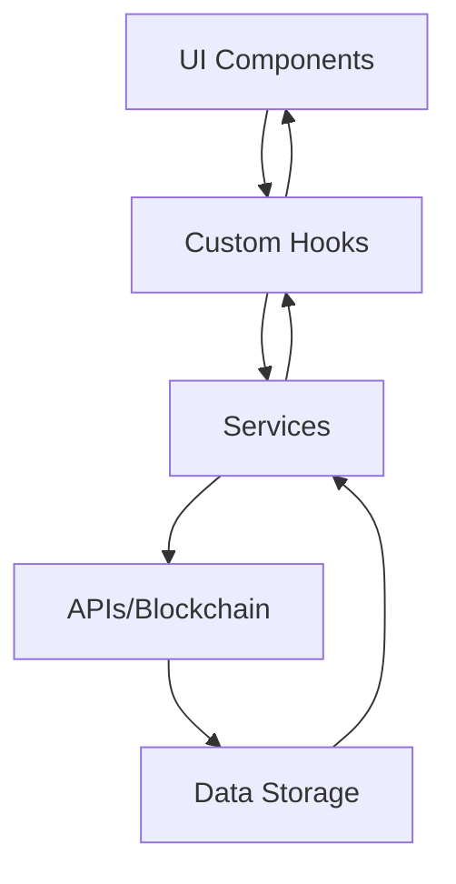

# Arquitetura do Sistema

## Visão Geral

O Open Invest Spotlight DAO é uma aplicação web moderna construída com uma arquitetura baseada em componentes React, utilizando TypeScript para tipagem estática e Vite como bundler. A arquitetura foi projetada para ser limpa, modular e escalável, seguindo os princípios SOLID e padrões de design modernos.

## Estrutura de Diretórios

```
src/
├── components/         # Componentes React reutilizáveis
├── pages/             # Páginas da aplicação
├── hooks/             # Custom hooks
├── services/          # Serviços de API e blockchain
├── utils/             # Funções utilitárias
├── types/             # Definições de tipos TypeScript
├── styles/            # Estilos globais e temas
├── config/            # Configurações da aplicação
├── assets/            # Recursos estáticos
└── journeys/          # Fluxos de usuário
```

## Camadas da Aplicação

### 1. Camada de Apresentação (UI)

#### Componentes React
- Utiliza shadcn-ui para componentes base
- Implementa design system próprio
- Segue princípios de atomic design

```typescript
// Exemplo de componente
interface ButtonProps {
  variant: 'primary' | 'secondary';
  size: 'sm' | 'md' | 'lg';
  children: React.ReactNode;
}

export const Button: React.FC<ButtonProps> = ({
  variant,
  size,
  children,
}) => {
  return (
    <button
      className={`button-${variant} button-${size}`}
    >
      {children}
    </button>
  );
};
```

#### Estilização
- Tailwind CSS para estilos
- CSS Modules para escopo local
- Temas dinâmicos

```typescript
// Exemplo de tema
const theme = {
  colors: {
    primary: '#0070f3',
    secondary: '#7928ca',
    background: '#ffffff',
  },
  spacing: {
    sm: '0.5rem',
    md: '1rem',
    lg: '2rem',
  },
};
```

### 2. Camada de Lógica de Negócio

#### Custom Hooks
- Gerenciamento de estado
- Lógica de negócio reutilizável
- Integração com serviços

```typescript
// Exemplo de hook
export const useInvestment = (projectId: string) => {
  const [investment, setInvestment] = useState<Investment>();
  const [loading, setLoading] = useState(true);

  useEffect(() => {
    const fetchInvestment = async () => {
      const data = await investmentService.get(projectId);
      setInvestment(data);
      setLoading(false);
    };

    fetchInvestment();
  }, [projectId]);

  return { investment, loading };
};
```

#### Serviços
- Integração com APIs
- Interação com blockchain
- Validação de dados

```typescript
// Exemplo de serviço
export class InvestmentService {
  async create(investment: Investment): Promise<void> {
    await validateInvestment(investment);
    await api.post('/investments', investment);
  }

  async get(projectId: string): Promise<Investment> {
    return api.get(`/investments/${projectId}`);
  }
}
```

### 3. Camada de Dados

#### Integração com APIs
- RESTful endpoints
- GraphQL queries
- WebSocket para tempo real

```typescript
// Exemplo de integração
const api = axios.create({
  baseURL: process.env.API_URL,
  headers: {
    'Content-Type': 'application/json',
  },
});
```

#### Blockchain
- Smart contracts
- Web3.js/ethers.js
- Eventos em tempo real

```typescript
// Exemplo de contrato
const contract = new ethers.Contract(
  CONTRACT_ADDRESS,
  CONTRACT_ABI,
  provider
);

contract.on('InvestmentCreated', (investor, amount) => {
  // Handle event
});
```

## Fluxo de Dados



## Princípios de Design

1. **Componentização**
   - Componentes pequenos e focados
   - Props bem definidas
   - Composição sobre herança

2. **Imutabilidade**
   - Estado imutável
   - Funções puras
   - Redux para gerenciamento de estado

3. **Tipagem**
   - TypeScript em todo o código
   - Interfaces bem definidas
   - Validação em tempo de compilação

4. **Testabilidade**
   - Testes unitários
   - Testes de integração
   - BDD para regras de negócio

## Padrões de Código

### Nomenclatura
- Componentes: PascalCase
- Hooks: camelCase com prefixo 'use'
- Serviços: PascalCase com sufixo 'Service'
- Tipos: PascalCase com prefixo 'I' para interfaces

### Estrutura de Componentes
```typescript
// Componente.tsx
import React from 'react';
import styles from './Component.module.css';

interface Props {
  // Props definition
}

export const Component: React.FC<Props> = ({
  // Props destructuring
}) => {
  // Hooks
  // Handlers
  // Render
  return (
    // JSX
  );
};
```

### Estrutura de Hooks
```typescript
// useFeature.ts
import { useState, useEffect } from 'react';

export const useFeature = (param: string) => {
  const [state, setState] = useState();

  useEffect(() => {
    // Effect logic
  }, [param]);

  return {
    state,
    // Exposed methods
  };
};
```

## Segurança

1. **Autenticação**
   - JWT tokens
   - OAuth2 para redes sociais
   - Web3 para carteiras

2. **Autorização**
   - RBAC (Role-Based Access Control)
   - Permissões granulares
   - Middleware de proteção

3. **Proteção de Dados**
   - Criptografia em trânsito
   - Sanitização de inputs
   - Validação de dados

## Performance

1. **Otimizações**
   - Code splitting
   - Lazy loading
   - Memoização

2. **Monitoramento**
   - Métricas de performance
   - Logs estruturados
   - Alertas automáticos

## Deployment

1. **Ambientes**
   - Development
   - Staging
   - Production

2. **CI/CD**
   - GitHub Actions
   - Testes automatizados
   - Deploy contínuo

## Manutenção

1. **Documentação**
   - JSDoc para código
   - Storybook para componentes
   - Wiki para processos

2. **Versionamento**
   - Semantic Versioning
   - Changelog
   - Releases

## Próximos Passos

1. **Melhorias Planejadas**
   - Implementação de SSR
   - Otimização de performance
   - Expansão de features

2. **Roadmap**
   - Fase 1: MVP
   - Fase 2: Escalabilidade
   - Fase 3: Expansão 