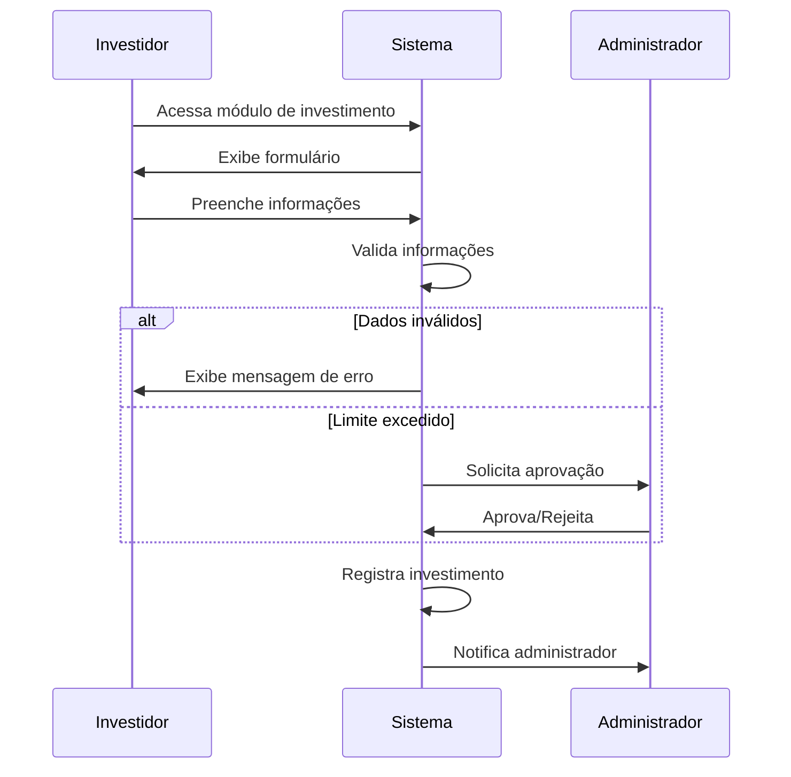
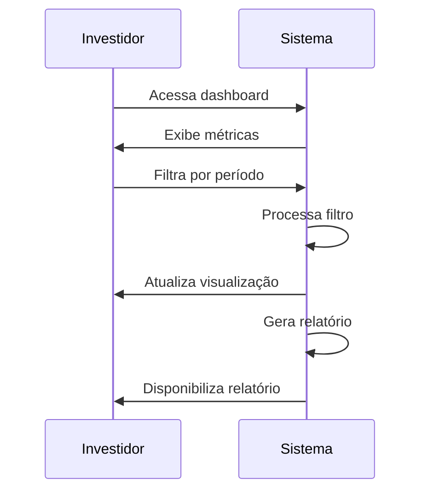
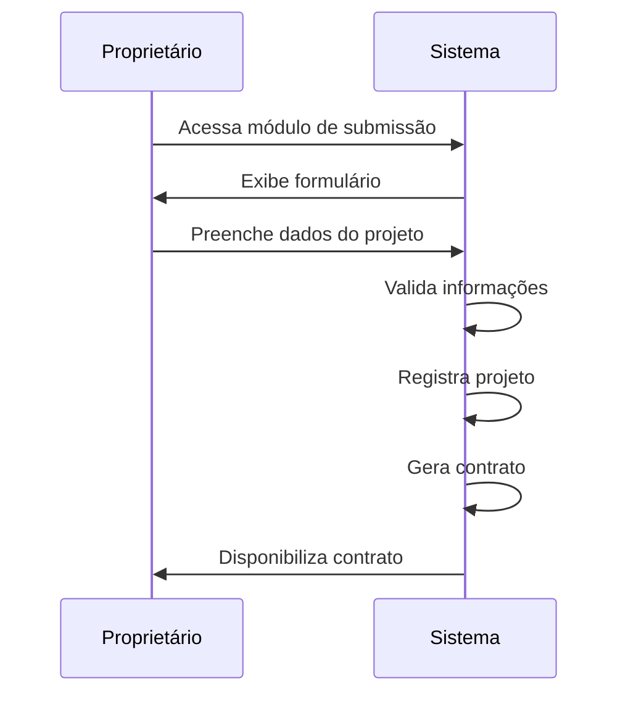
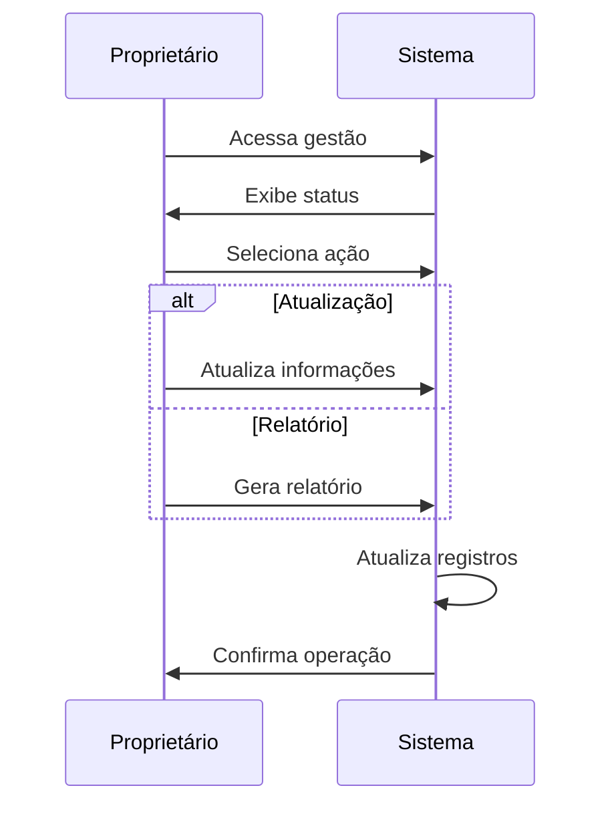
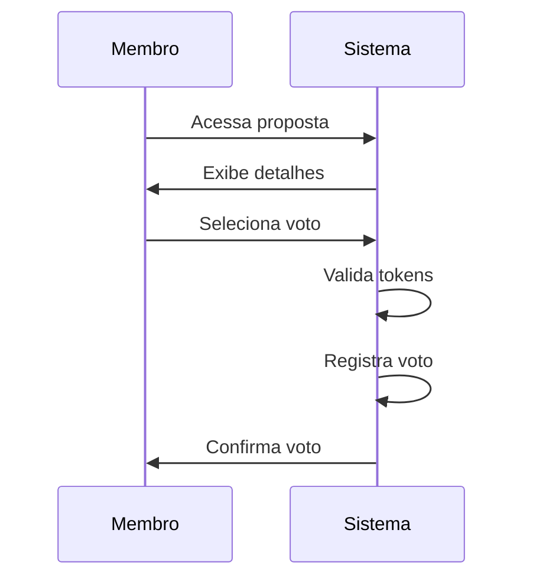
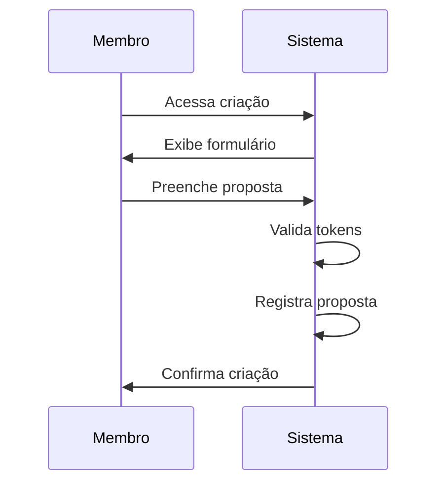
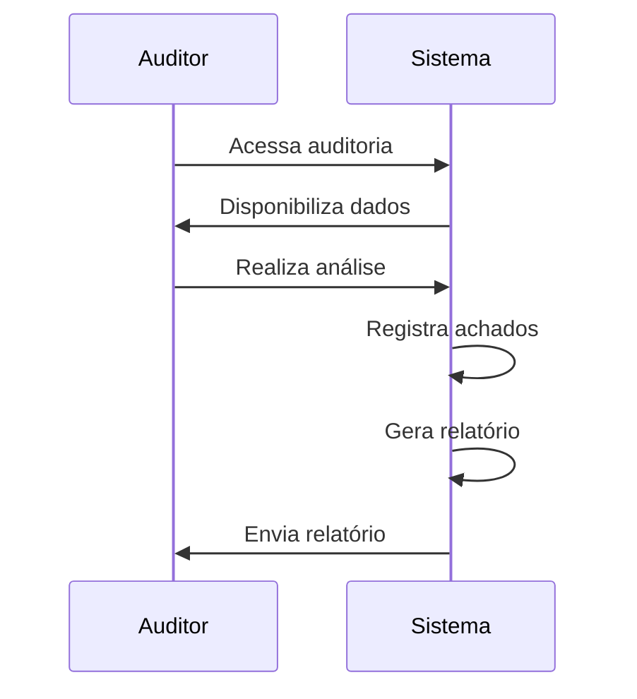

# Casos de Uso do Sistema

## Visão Geral

Este documento detalha os principais casos de uso do Open Invest Spotlight DAO, descrevendo as interações entre os diferentes atores do sistema e os fluxos de operação.

## Atores do Sistema

1. **Investidor**: Usuário que investe em projetos
2. **Proprietário de Projeto**: Criador e gestor de projetos
3. **Membro DAO**: Participante da governança
4. **Administrador**: Gestor do sistema
5. **Auditor**: Responsável por auditorias

## Casos de Uso

### 1. Gestão de Investimentos

#### UC1.1 - Cadastrar Novo Investimento
**Atores**: Investidor, Administrador
**Pré-condições**: 
- Investidor autenticado
- Carteira conectada
- Saldo suficiente

**Fluxo Principal**:
1. Investidor acessa módulo de investimento
2. Sistema exibe formulário
3. Investidor preenche:
   - Valor do investimento
   - Projeto alvo
   - Prazo
4. Sistema valida informações
5. Sistema registra investimento
6. Sistema notifica administrador

**Fluxos Alternativos**:
- 4a. Dados inválidos: Sistema exibe mensagem de erro
- 5a. Limite excedido: Sistema solicita aprovação adicional

#### UC1.2 - Monitorar Performance
**Atores**: Investidor
**Pré-condições**: 
- Investimentos cadastrados

**Fluxo Principal**:
1. Investidor acessa dashboard
2. Sistema exibe métricas:
   - Retorno sobre investimento
   - Comparativo com benchmark
   - Risco do portfólio
3. Investidor pode filtrar por período
4. Sistema gera relatório de performance

### 2. Gestão de Projetos

#### UC2.1 - Submeter Novo Projeto
**Atores**: Proprietário de Projeto
**Pré-condições**: 
- Usuário autenticado
- Documentação completa

**Fluxo Principal**:
1. Proprietário acessa módulo de submissão
2. Sistema exibe formulário
3. Proprietário preenche:
   - Dados do projeto
   - Documentação
   - Metas de financiamento
4. Sistema valida informações
5. Sistema registra projeto
6. Sistema gera contrato

#### UC2.2 - Gerenciar Projeto
**Atores**: Proprietário de Projeto
**Pré-condições**: 
- Projeto cadastrado

**Fluxo Principal**:
1. Proprietário acessa gestão
2. Sistema exibe status do projeto
3. Proprietário pode:
   - Atualizar informações
   - Gerar relatórios
   - Gerenciar equipe
4. Sistema atualiza registros
5. Sistema confirma operação

### 3. Governança

#### UC3.1 - Votar em Proposta
**Atores**: Membro DAO
**Pré-condições**: 
- Membro autenticado
- Tokens de governança

**Fluxo Principal**:
1. Membro acessa proposta
2. Sistema exibe detalhes
3. Membro seleciona voto
4. Sistema valida tokens
5. Sistema registra voto
6. Sistema confirma voto

#### UC3.2 - Criar Proposta
**Atores**: Membro DAO
**Pré-condições**: 
- Membro autenticado
- Tokens suficientes

**Fluxo Principal**:
1. Membro acessa criação
2. Sistema exibe formulário
3. Membro preenche:
   - Título
   - Descrição
   - Impacto
4. Sistema valida tokens
5. Sistema registra proposta
6. Sistema confirma criação

### 4. Auditoria

#### UC4.1 - Realizar Auditoria
**Atores**: Auditor
**Pré-condições**: 
- Auditor autenticado
- Acesso concedido

**Fluxo Principal**:
1. Auditor acessa módulo
2. Sistema disponibiliza dados
3. Auditor realiza análise
4. Sistema registra achados
5. Sistema gera relatório
6. Sistema envia relatório

## Regras de Negócio

1. **Investimentos**:
   - Valor mínimo: $100
   - Período mínimo: 30 dias
   - Taxa de administração: 2%

2. **Projetos**:
   - Documentação obrigatória
   - Meta mínima: $10,000
   - Prazo máximo: 12 meses

3. **Governança**:
   - Quórum mínimo: 51%
   - Período de votação: 7 dias
   - Tokens necessários: 100

4. **Auditoria**:
   - Frequência: Trimestral
   - Escopo: Todos os projetos
   - Prazo: 30 dias

## Exceções

1. **Investimentos**:
   - Cancelamento em 24h
   - Reembolso parcial
   - Taxas de saída

2. **Projetos**:
   - Extensão de prazo
   - Ajuste de meta
   - Cancelamento

3. **Governança**:
   - Veto de emergência
   - Proposta urgente
   - Quórum reduzido

## Próximos Passos

1. **Melhorias Planejadas**:
   - Automação de auditoria
   - Análise de risco
   - Relatórios personalizados

2. **Expansão**:
   - Novos tipos de investimento
   - Mais opções de governança
   - Integração com DeFi 