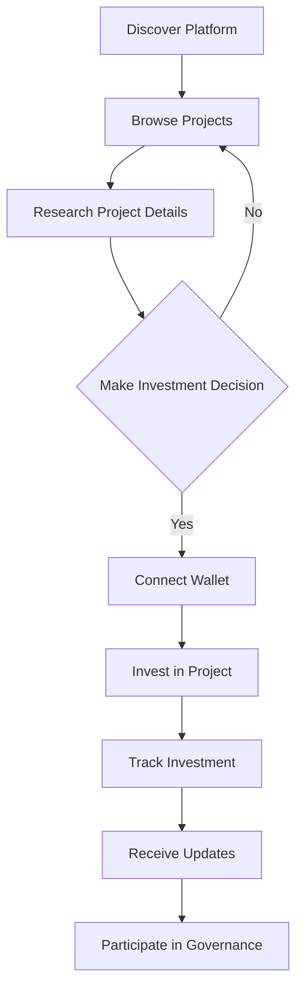
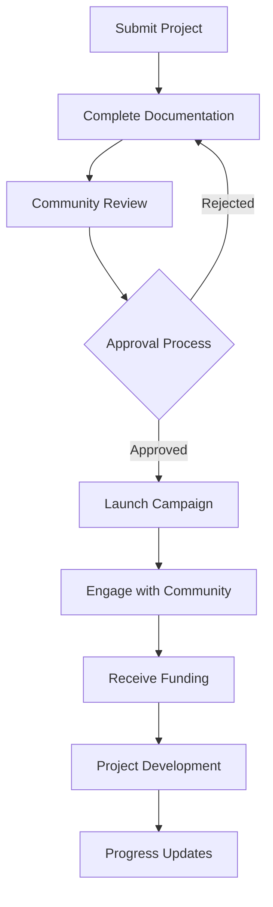
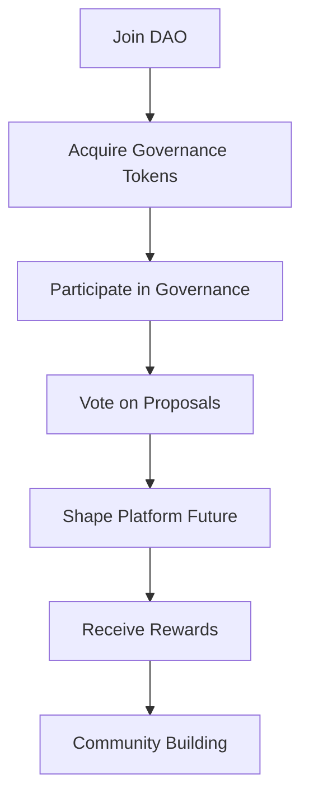
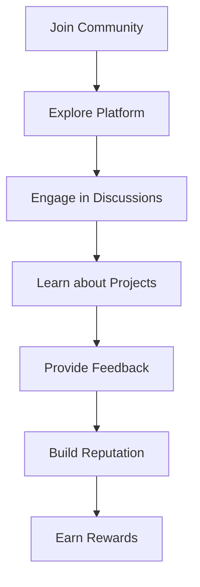
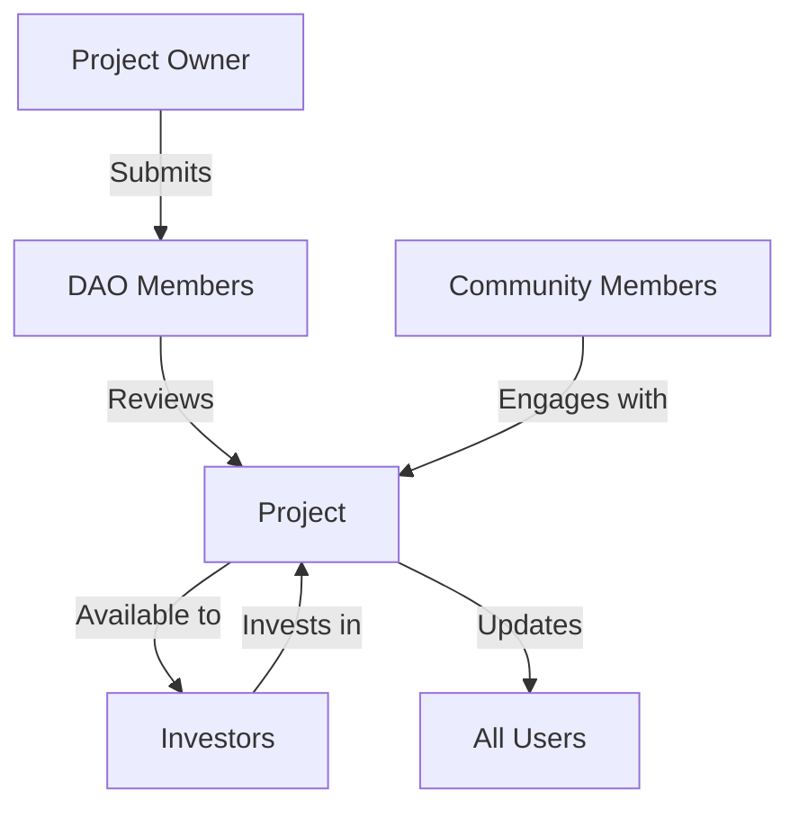

# User Journeys Documentation

## Overview
This document outlines the different user journeys within the Open Invest Spotlight DAO platform. We'll explore the experiences of various user types through detailed flow diagrams and descriptions.

## User Types

1. **Investor**
2. **Project Owner**
3. **DAO Member**
4. **Community Member**

## Investor Journey

### Flow Diagram

### Detailed Steps
1. **Discovery**
   - Land on platform homepage
   - Browse featured projects
   - View project categories

2. **Research**
   - Read project documentation
   - Review team information
   - Analyze financial projections
   - Check community engagement

3. **Investment**
   - Connect cryptocurrency wallet
   - Select investment amount
   - Review terms and conditions
   - Complete investment transaction

4. **Post-Investment**
   - Track investment performance
   - Receive regular updates
   - Participate in project governance
   - Access exclusive content

## Project Owner Journey

### Flow Diagram

### Detailed Steps
1. **Project Submission**
   - Create project profile
   - Upload documentation
   - Set funding goals
   - Define tokenomics

2. **Review Process**
   - Community feedback
   - Technical review
   - Due diligence
   - Approval voting

3. **Campaign Launch**
   - Marketing materials
   - Community engagement
   - Investor outreach
   - AMA sessions

4. **Project Development**
   - Regular updates
   - Milestone tracking
   - Community feedback
   - Governance participation

## DAO Member Journey

### Flow Diagram

### Detailed Steps
1. **DAO Entry**
   - Purchase governance tokens
   - Complete verification
   - Join community channels
   - Review governance rules

2. **Governance Participation**
   - Review proposals
   - Participate in discussions
   - Cast votes
   - Submit proposals

3. **Community Impact**
   - Shape platform direction
   - Influence project selection
   - Contribute to improvements
   - Earn rewards

## Community Member Journey

### Flow Diagram

### Detailed Steps
1. **Community Entry**
   - Create profile
   - Join social channels
   - Complete onboarding
   - Set preferences

2. **Engagement**
   - Participate in discussions
   - Share knowledge
   - Provide feedback
   - Help new members

3. **Growth**
   - Build reputation
   - Earn community points
   - Access exclusive content
   - Influence community direction

## Cross-User Interactions

### Flow Diagram

## Key Features for Each User Type

### Investors
- Portfolio tracking
- Investment analytics
- Governance participation
- Risk assessment tools

### Project Owners
- Project management tools
- Funding tracking
- Community engagement
- Progress reporting

### DAO Members
- Governance dashboard
- Proposal management
- Voting history
- Reward tracking

### Community Members
- Discussion forums
- Knowledge base
- Event calendar
- Reward system

## Success Metrics

### For Investors
- ROI tracking
- Portfolio diversification
- Governance participation rate
- Community engagement

### For Project Owners
- Funding success rate
- Community growth
- Development milestones
- Investor satisfaction

### For DAO Members
- Proposal success rate
- Voting participation
- Community impact
- Reward earnings

### For Community Members
- Engagement metrics
- Knowledge sharing
- Community growth
- Reward accumulation
